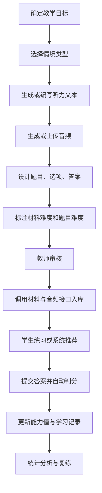

# 《AI 情境听力教学系统设计与开发》NLP 动态任务设计指南

## 1. 文档目的

本文档用于说明《AI 情境听力教学系统设计与开发》中 NLP 动态任务的设计思路、资源生成流程、任务结构、数据入库规范，以及其与当前后端项目的材料管理、练习提交、智能推荐和能力评估模块之间的关系。

需求文档提出“基于 Seq2Seq 模型与 WaveNet 语音合成技术，开发包含‘学术讲座+商务谈判’的智能情境资源库”。结合本项目实现，Seq2Seq 可作为情境文本、题目、选项、摘要和解析的生成或辅助生成思路；WaveNet 的目标是生成听力音频，而当前项目通过直接给定音频并登记到 `audio_assets` 的方式完成音频接入。也就是说，本系统已经具备 NLP 动态任务落库、练习、评估和推荐所需的后端闭环。

## 2. NLP 动态任务定义

NLP 动态任务是指根据教学目标、情境类型、学生能力水平和材料难度，动态组织听力文本、题目、选项、答案和反馈的任务单元。

在当前系统中，一个动态任务通常对应一份听力材料，主要包含：

- 情境类型：学术讲座、商务谈判等。
- 听力文本：材料原文或对话脚本。
- 音频资源：已上传或外部生成的听力音频。
- 任务题目：围绕听力文本设计的理解题。
- 标准答案：用于自动判分。
- 难度标签：用于能力评估和个性化推荐。
- 作答记录：用于学习分析和后续复练。

## 3. 与当前项目的模块对应

| NLP 动态任务环节 | 当前项目模块 | 相关代码/数据 |
| --- | --- | --- |
| 学生画像 | 用户与能力状态 | `students.theta`、`student_ability_state` |
| 情境材料 | 材料管理 | `MaterialController`、`MaterialService`、`materials` |
| 音频接入 | 音频资源模块 | `AudioController`、`audio_assets` |
| 题目与选项 | 题库管理 | `questions`、`question_options` |
| 任务发放 | 练习获取接口 | `/api/material/get-practice` |
| 个性化推荐 | 推荐算法 | `/practice/get-recommend` |
| 自动判分 | 练习提交 | `/practice/submit` |
| 能力更新 | IRT/Bayesian 能力估计 | `AbilityEstimator` |
| 学习诊断 | 管理端统计 | `StatisticsService`、`AdminPracticeService` |

## 4. Seq2Seq 在本项目中的角色

Seq2Seq 模型适合处理“输入序列到输出序列”的文本生成任务。在本项目中，它可作为动态任务生产链中的辅助生成模块，而不是必须直接嵌入当前后端服务。

可支持的生成任务包括：

1. 根据场景标签生成听力脚本。
2. 根据听力脚本生成摘要或场景说明。
3. 根据听力文本生成理解题。
4. 根据正确答案生成干扰选项。
5. 根据学生答题结果生成学习反馈。
6. 根据材料难度改写文本，使其更适合不同能力层级学生。

当前项目后端主要承担生成后资源的管理、发布、练习和评估。Seq2Seq 或大语言模型生成的内容经过教师审核后，可通过材料上传接口进入系统。

## 5. WaveNet 与音频接入说明

WaveNet 是一种神经语音合成技术，常用于将文本转换为自然语音。需求中提到 WaveNet，本质目标是为听力材料生成高质量音频。

当前系统未直接调用 WaveNet 服务，而是采用“音频已给定、系统负责接入”的实现方式：

1. 教师、资源制作人员或外部 TTS 系统生成音频。
2. 音频上传到可访问的文件存储或本地资源路径。
3. 后端通过 `/api/audio/register` 登记音频元数据。
4. 后端通过 `/api/audio/bindMaterial` 将音频绑定到听力材料。
5. 学生练习时通过材料接口获取音频 ID 或音频路径。

这种设计将语音合成和教学业务解耦。后续如需接入 WaveNet，只需在音频生产环节新增 TTS 服务调用，生成的音频仍可沿用现有 `audio_assets` 和 `materials.audioId` 数据结构。

## 6. 动态任务设计流程



### 6.1 确定教学目标

每个任务应先明确训练目标，例如：

- 听懂学术讲座主旨。
- 捕捉商务谈判中的价格和时间信息。
- 判断说话人的态度和立场。
- 根据上下文推断隐含含义。
- 识别听力文本中的转折、因果和总结信号。

### 6.2 选择情境类型

当前需求重点包含两类情境：

- 学术讲座：适合训练主旨理解、逻辑结构、细节定位和观点判断。
- 商务谈判：适合训练角色意图、关键信息、条件协商和语用推断。

后续可扩展为校园生活、求职面试、会议讨论、跨文化交流、实验说明等类型。

### 6.3 生成或编写听力文本

文本可采用人工编写、Seq2Seq 辅助生成或大语言模型生成。生成时应控制：

- 主题清晰。
- 句式自然。
- 难度与目标学生匹配。
- 信息点足够支撑题目。
- 学术讲座应具备结构性。
- 商务谈判应具备交互性和目的性。

### 6.4 生成或上传音频

音频可以来自真人录制、WaveNet 合成、其他 TTS 系统或已有教学资源。本项目当前采用上传或给定音频的模式，核心要求是音频与文本一致，且可被前端稳定播放。

### 6.5 设计题目、选项和答案

题目应从文本信息中自然产生，避免脱离材料。选择题建议采用 A/B/C/D 形式，与当前 `correctKey` 字段一致。

题目类型建议包括：

| 题型 | 说明 | 适用情境 |
| --- | --- | --- |
| 主旨题 | 判断材料主要内容 | 学术讲座、报告 |
| 细节题 | 识别数字、时间、地点、人物、事实 | 所有情境 |
| 推理题 | 根据上下文推断隐含意思 | 学术讲座、商务谈判 |
| 态度题 | 判断说话人态度或立场 | 商务谈判、访谈 |
| 结构题 | 识别原因、结果、转折、总结 | 学术讲座 |
| 意图题 | 判断说话人目的或谈判策略 | 商务谈判 |

### 6.6 标注难度

材料难度写入 `materials.level`，题目难度写入 `questions.difficulty`。当前系统使用 1 到 10 的能力量表，建议规则如下：

| 难度区间 | 含义 | 材料特征 |
| --- | --- | --- |
| 1.0 - 3.0 | 基础 | 语速慢、词汇简单、信息点少 |
| 3.1 - 5.0 | 初中级 | 常见话题、句式清晰、少量干扰信息 |
| 5.1 - 7.0 | 中高级 | 信息密度较高、存在推理和态度判断 |
| 7.1 - 10.0 | 高级 | 专业词汇多、语速快、逻辑复杂或多轮谈判 |

难度值直接影响推荐算法和能力评估结果，因此应由教师审核确认。

## 7. 动态任务数据规范

### 7.1 材料数据

```json
{
  "title": "Negotiating a Delivery Schedule",
  "level": 6.8,
  "transcript": "Good morning, thanks for joining the meeting...",
  "audioId": 1001,
  "questions": [
    {
      "qOrder": 1,
      "stem": "What is the main purpose of the meeting?",
      "difficulty": 6.5,
      "correctKey": "B",
      "options": [
        {"optionKey": "A", "optionText": "To cancel an order"},
        {"optionKey": "B", "optionText": "To discuss delivery arrangements"},
        {"optionKey": "C", "optionText": "To introduce a new employee"},
        {"optionKey": "D", "optionText": "To review last year's sales"}
      ]
    }
  ]
}
```

### 7.2 音频数据

```json
{
  "localPath": "cloud://audio/business_negotiation_001.mp3",
  "mimeType": "audio/mpeg",
  "durationMs": 125000,
  "bytes": 2048000,
  "sha256": "..."
}
```

实际字段应以 `RegisterAudioRequest` 和 `AudioAsset` 模型为准。

## 8. 学术讲座任务设计模板

### 8.1 输入模板

```text
情境类型：学术讲座
主题：新能源技术
目标能力：主旨理解、细节定位、观点判断
目标难度：6.0
文本长度：约 250-350 词
题目数量：5 题
题型比例：主旨 1 题、细节 2 题、推理 1 题、态度 1 题
```

### 8.2 输出要求

- 脚本应体现讲座导入、主体展开和总结。
- 应包含若干可被题目考查的关键信息点。
- 不应出现与题目无关的过多背景噪声。
- 题目应覆盖不同理解层级。
- 选项应具有合理干扰性，但不能含糊到无法判断。

### 8.3 入库映射

- 讲座标题写入 `materials.title`。
- 讲座文本写入 `materials.transcript`。
- 讲座难度写入 `materials.level`。
- 讲座音频登记到 `audio_assets`。
- 题目写入 `questions`。
- 选项写入 `question_options`。

## 9. 商务谈判任务设计模板

### 9.1 输入模板

```text
情境类型：商务谈判
主题：产品交付时间协商
角色：供应商代表、客户经理
目标能力：细节定位、意图判断、条件推断
目标难度：7.0
文本形式：双人或多人对话
题目数量：5 题
题型比例：细节 2 题、意图 1 题、推理 1 题、结论 1 题
```

### 9.2 输出要求

- 对话应体现明确的商务目的。
- 角色表达应符合商务语境。
- 应包含价格、时间、条件、让步或异议等关键信息。
- 干扰选项可来自谈判中被否定或修改过的信息。
- 题目应考查学生对最终结论和隐含意图的理解。

### 9.3 入库映射

- 谈判主题写入 `materials.title`。
- 对话脚本写入 `materials.transcript`。
- 难度写入 `materials.level`。
- 音频登记并绑定到材料。
- 多轮对话理解题写入题目和选项表。

## 10. 个性化推荐与动态发放

动态任务不是随机发放，而是结合学生能力状态进行推荐。当前系统中，学生能力值保存在 `students.theta`，能力不确定性保存在 `student_ability_state.thetaVar`。

推荐模块会筛选学生未练习过且已启用的材料，并根据材料难度与学生能力值的接近程度计算匹配分。推荐目标是让学生接触“略有挑战但可完成”的听力任务，从而提升练习效率。

推荐逻辑与 NLP 任务的关系如下：

1. NLP 负责生成或组织不同难度的任务资源。
2. 材料管理模块负责保存资源。
3. 推荐模块根据学生能力选择合适资源。
4. 练习提交模块记录结果。
5. 能力评估模块根据作答结果更新学生画像。
6. 新画像继续影响下一轮任务推荐。

## 11. 自动判分与能力更新

学生提交答案后，系统根据 `questions.correctKey` 自动判断每题是否正确，并保存到 `attempt_answers`。如果该学生首次练习该材料，系统会调用 `AbilityEstimator` 更新能力值。

能力更新考虑以下因素：

- 当前能力值。
- 当前能力方差。
- 题目难度。
- 每题答对或答错情况。
- 单次更新步长上限。

这使系统不仅能计算分数，还能根据学生长期表现形成持续变化的能力画像。

## 12. 教师审核规范

由于 NLP 自动生成内容可能存在事实错误、语言不自然、选项歧义或难度不准等问题，所有动态任务正式发布前都应经过教师审核。

审核重点包括：

1. 文本是否符合教学主题。
2. 音频是否清晰、自然、与文本一致。
3. 题目是否能从文本中找到依据。
4. 正确答案是否唯一。
5. 干扰项是否合理。
6. 难度标注是否符合学生水平。
7. 是否存在不适合教学场景的内容。

审核通过后，材料才能启用并进入推荐池。

## 13. 后续扩展建议

1. 新增场景字段：在材料表中加入 `scene_type`、`task_type`、`tags` 等字段。
2. 新增解析字段：为题目增加答案解析，便于学生练后反馈。
3. 新增知识点标签：将题目关联到主旨、细节、推理、态度等能力点。
4. 引入生成服务：封装 Seq2Seq 或大语言模型接口，生成材料草稿。
5. 引入音频合成服务：将 WaveNet 或其他 TTS 作为音频生产插件。
6. 建立教师审核流：生成内容先进入草稿状态，审核后再启用。
7. 引入难度校准：根据全体学生答题正确率动态修正材料和题目难度。
8. 生成个性化反馈：根据错题类型自动生成学习建议。

## 14. 总结

本项目的 NLP 动态任务设计以听力材料为核心，以学生能力画像和智能推荐为驱动，形成“资源生成、教师审核、材料入库、个性化发放、自动判分、能力更新、统计反馈”的完整闭环。

虽然当前系统没有直接部署 Seq2Seq 和 WaveNet 模型，但已经为它们预留了清晰的接入位置：Seq2Seq 可服务于文本、题目和反馈生成，WaveNet 可服务于音频生产，而现有后端负责资源管理、练习执行、数据记录和学习分析。这种设计既能回应智能情境资源库的建设目标，也能与当前项目代码保持一致。
