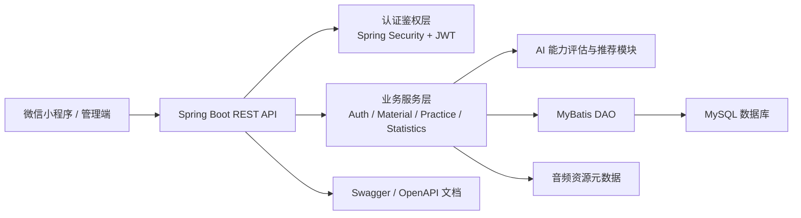
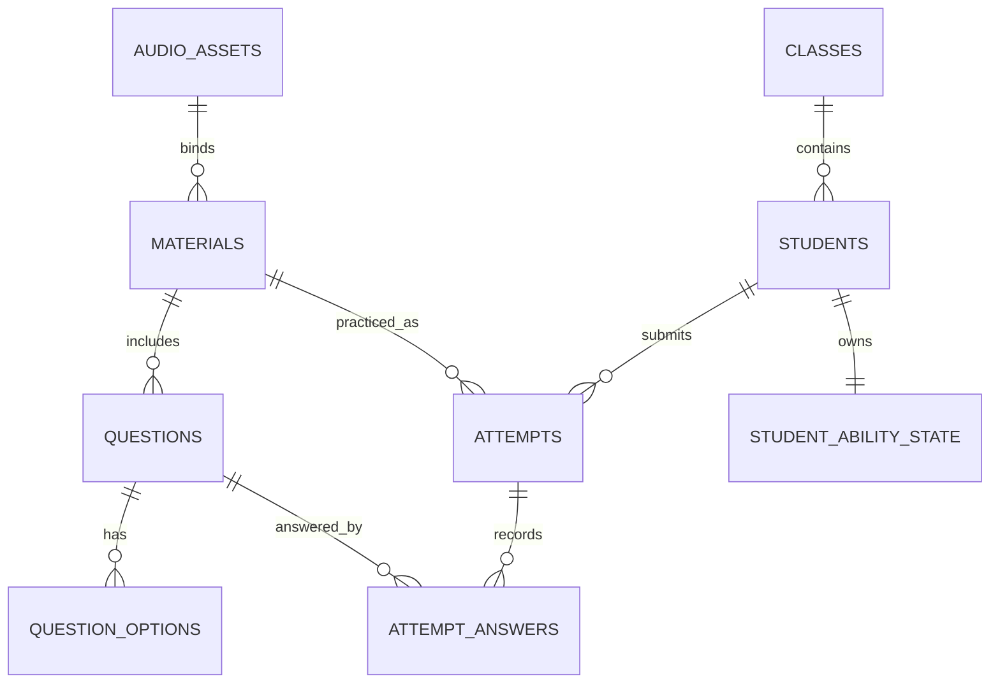

# 《AI 情境听力教学系统设计与开发》技术方案

## 1. 项目概述

《AI 情境听力教学系统设计与开发》面向高校英语听力教学与自主练习场景，围绕“听力材料管理、学生身份绑定、在线听力练习、智能推荐、能力评估、教师统计分析”等核心需求，构建一套可部署在微信云托管环境中的听力教学后端系统。

系统以 Spring Boot 为后端主体，结合 MySQL 持久化、MyBatis 数据访问、JWT 登录认证、微信小程序云托管调用能力，实现学生端练习闭环与教师端教学管理闭环。当前项目重点体现的 AI 能力主要包括基于学生答题表现的听力能力估计、基于能力值与材料难度匹配的个性化推荐，以及面向后续内容生成、语音生成、学习诊断扩展的服务化架构基础。

## 2. 建设目标

1. 支持学生通过微信小程序完成登录、绑定学号、获取听力材料、提交答案、查看练习记录和错题复练。
2. 支持教师或管理员维护听力材料、音频资源、题目、选项、标准答案和材料难度。
3. 根据学生历史练习表现动态更新听力能力值，形成个体化学习画像。
4. 根据学生能力值、材料难度和未练习状态推荐合适的听力材料，避免练习过难或过易。
5. 提供班级、学生、练习、正确率、排行榜等统计数据，服务教学诊断和教学干预。
6. 采用容器化方式部署，适配微信云托管和 MySQL 环境，便于后续扩容与运维。

## 3. 总体架构

系统采用前后端分离与分层后端架构。学生和教师通过小程序或前端管理界面访问后端 REST API，后端完成认证鉴权、业务编排、数据读写、能力估计和推荐计算。



后端工程当前主要包结构如下：

- `controller`：REST 接口层，负责接收请求、参数传递和统一响应。
- `service` 与 `service.impl`：业务服务层，承载登录、材料、练习、统计、班级、音频等核心逻辑。
- `service.ability`：能力估计算法模块。
- `dao`：MyBatis Mapper 数据访问层。
- `model`：数据库实体模型。
- `dto`：请求与响应数据传输对象。
- `security` 与 `config`：JWT、Spring Security、异常响应、密码配置等基础能力。

## 4. 技术选型

| 技术方向 | 选型 | 说明 |
| --- | --- | --- |
| 后端框架 | Spring Boot 2.5.5 | 提供 Web、配置、依赖管理和服务启动能力 |
| 运行环境 | Java 17 | 项目 `pom.xml` 中配置 Java 17 |
| Web 接口 | Spring MVC | 提供 REST API |
| 安全框架 | Spring Security + JWT | 实现学生和管理员身份认证 |
| 数据访问 | MyBatis | 通过 Mapper 访问 MySQL |
| 数据库 | MySQL | 存储用户、班级、材料、题目、练习记录、能力状态 |
| 接口文档 | springdoc-openapi-ui | 支持 Swagger/OpenAPI 文档 |
| 构建工具 | Maven | 使用 `mvnw` 或 Maven 构建 |
| 部署方式 | Docker + 微信云托管 | 通过 `Dockerfile` 和 `container.config.json` 部署 |

## 5. 功能模块设计

### 5.1 用户认证与身份绑定模块

认证模块提供学生微信登录、学籍绑定、管理员登录和当前用户信息查询能力。

学生端通过微信云托管请求头 `X-WX-OPENID` 获取微信 openid，系统根据 openid 建立或查询学生身份；未绑定学生可提交学号、姓名、学院、班级等信息完成绑定。登录成功后，后端签发 JWT，并在会话表中保存 token hash，用于后续请求校验和会话失效控制。

管理员端通过用户名和密码登录，密码使用哈希方式保存。管理员 JWT 中包含角色信息和密码哈希指纹，当密码变化或账号禁用时，可使旧 token 失效。

主要接口包括：

- `POST /api/auth/login`：学生微信登录。
- `POST /api/auth/bind`：学生绑定学籍信息并登录。
- `GET /api/auth/me`：获取当前学生信息。
- `POST /api/auth/adminLogin`：管理员登录。
- `POST /api/admin/create`：创建管理员账号。

### 5.2 班级与学生管理模块

班级模块用于维护教学组织结构，学生记录关联到班级，实现班级维度的练习统计、学生人数统计和教学分析。学生模型包含学号、姓名、学院、班级、微信 openid、能力值 `theta` 等字段。

该模块为教师端提供按班级查看学生练习表现、按学生查看练习历史和能力变化的基础数据。

### 5.3 听力材料与题库管理模块

材料模块负责听力内容的新增、编辑、启用、软删除、硬删除和按 ID 查询。一个听力材料包含标题、难度等级、原文转写、音频资源 ID 和启用状态；每个材料下包含多道题目，每道题目包含题干、题目顺序、难度、正确答案和选项。

主要接口包括：

- `POST /api/material/upload`：创建材料及题目。
- `GET /api/material/list`：获取材料列表。
- `GET /api/material/get-material/{id}`：获取材料编辑详情。
- `PUT /api/material/update/{id}`：更新材料及题目。
- `PUT /api/material/activate/{id}`：启用材料。
- `DELETE /api/material/delete/{id}`：软删除材料。
- `DELETE /api/material/hard-delete/{id}`：硬删除材料。

### 5.4 音频资源模块

音频模块用于登记上传后的听力音频资源元数据，包括文件路径、MIME 类型、时长、文件大小和 SHA-256 摘要。材料通过 `audioId` 绑定音频资源，实现材料内容和音频文件的解耦。

主要接口包括：

- `POST /api/audio/register`：登记音频资源。
- `POST /api/audio/bindMaterial`：将音频资源绑定到材料。

### 5.5 在线练习模块

练习模块负责给学生发放听力练习、接收答案、计算正确情况、记录练习过程，并在首次练习某材料时更新学生能力值。

练习提交流程如下：

1. 校验登录学生、材料 ID 和答案列表。
2. 查询材料下所有题目，校验答案题目数量和题目归属。
3. 按题目标准答案判断每题是否正确。
4. 判断学生是否已练习过该材料；重复练习只记录练习明细，不重复更新能力值。
5. 首次练习时调用能力估计算法更新 `theta` 和 `thetaVar`。
6. 写入 `attempts` 练习记录和 `attempt_answers` 每题作答记录。
7. 返回总题数、正确数、能力变化、方差变化和逐题答案结果。

主要接口包括：

- `GET /api/material/get-practice`：获取一份练习材料。
- `GET /api/material/get-practice-specific/{id}`：获取指定材料练习。
- `POST /practice/submit`：提交练习答案并更新能力。
- `GET /practice/get-practiced`：获取个人练习记录。
- `GET /practice/get-practiced-detail/{attemptId}`：获取某次练习详情。
- `GET /practice/redo/{materialId}`：获取复练材料和上次选择。
- `GET /practice/question-count`：获取练习材料数、作答题数和去重题数。

### 5.6 智能推荐模块

推荐模块根据学生当前能力值 `theta`、能力不确定性 `thetaVar` 和未练习材料难度，计算材料匹配分并返回 Top 5 推荐材料。

当前推荐策略综合两类因素：

- 难度接近度：材料难度越接近学生能力值，匹配度越高。
- 信息量：基于 IRT 思想，学生答对此材料中对应难度题目的概率接近 0.5 时，材料对能力估计的信息量更高。

系统初期允许更宽的推荐范围；随着练习次数增加、方差降低，推荐逐步集中到更适合学生当前水平的材料区间。

主要接口：

- `GET /practice/get-recommend`：获取个性化推荐材料。

### 5.7 能力评估模块

能力评估模块位于 `AbilityEstimator`，用于在学生完成一次材料练习后动态更新听力能力值。当前模型采用一维能力值 `theta`，取值范围为 1.0 到 10.0；题目难度与能力值使用同一量表。

算法思想结合 IRT Logistic 模型与贝叶斯更新：

```text
P(correct | theta, difficulty) = sigmoid((theta - difficulty) / beta)
```

其中：

- `theta`：学生听力能力值。
- `difficulty`：题目难度。
- `beta`：区分度/平滑参数，当前为 1.0。

每次提交后，系统根据所有题目的答对/答错情况累计梯度和信息量，使用单步 Newton 更新能力值，并通过过程噪声避免能力估计过早锁死。关键参数包括：

- `THETA_MIN = 1.0`，`THETA_MAX = 10.0`：能力值上下界。
- `BETA = 1.0`：Logistic 模型平滑参数。
- `PROCESS_NOISE_Q = 0.08`：过程噪声，用于保持模型可适应性。
- `STEP_CAP = 0.8`：单次练习能力更新最大步长。

该设计既能体现答对难题带来的能力提升，也能体现答错简单题带来的能力下降，同时避免单次练习造成过大波动。

### 5.8 教师统计与教学诊断模块

统计模块面向教师和管理员，提供学生排行榜、学生练习历史、单次练习详情、学生练习报告等数据。教师可据此识别高低水平学生、查看材料正确率、分析某个学生的练习轨迹和薄弱内容。

主要接口包括：

- `GET /api/admin/leaderboard`：学生排行榜。
- `GET /api/admin/get-student-detailed/{id}`：获取学生练习记录。
- `GET /api/admin/get-student-practiced-detailed/{attemptId}`：获取学生某次练习明细。
- `GET /api/admin/get-student-practice-statistics/{id}`：获取学生练习统计报告。

## 6. 数据模型设计

结合当前代码，系统核心数据表可规划如下：

| 数据域 | 主要表 | 说明 |
| --- | --- | --- |
| 用户与班级 | `students`、`student_roster`、`classes`、`admin_users`、`sessions` | 学生身份、班级、管理员、登录会话 |
| 材料与题库 | `materials`、`questions`、`question_options` | 听力材料、题目、选项、答案、难度 |
| 音频资源 | `audio_assets`、`avatar_assets` | 听力音频和头像资源元数据 |
| 练习记录 | `attempts`、`attempt_answers` | 每次练习和逐题作答记录 |
| 能力状态 | `student_ability_state` | 学生能力方差、练习次数、更新时间 |

核心实体关系如下：



当前 `src/main/resources/db.sql` 仍保留微信云托管模板中的 `Counters` 示例表，建议在后续开发中补齐正式建表脚本、索引、外键约束和初始化数据，确保部署环境可自动初始化完整业务数据库。

## 7. 接口与响应规范

系统接口统一返回 `ApiResponse`，通常包含：

- `code`：业务状态码。
- `data`：业务数据。
- `errorMsg` 或错误信息：异常说明。

认证接口以外的大部分业务接口需要在请求头中携带：

```http
Authorization: Bearer <token>
```

微信学生登录和绑定接口依赖微信云托管注入的：

```http
X-WX-OPENID: <openid>
```

接口文档可通过 `springdoc-openapi-ui` 生成，部署后可开放 Swagger UI 供前后端联调使用。

## 8. 安全设计

1. 认证机制：学生和管理员均使用 JWT，后端通过 `JwtAuthFilter` 解析 token 并设置 Spring Security 上下文。
2. 会话校验：学生 token 会保存 SHA-256 hash 到会话表，请求时校验 hash 并刷新会话时间。
3. 管理员失效控制：管理员 token 携带密码哈希指纹，密码变化后旧 token 自动失效。
4. 密码保护：管理员密码应使用安全哈希算法保存，避免明文存储。
5. 接口隔离：登录、绑定、健康检查、班级列表等公共接口放行，其余接口默认要求认证。
6. 数据保护：学生只能访问自己的练习与能力数据；管理员接口应进一步启用 `ROLE_ADMIN` 鉴权。
7. 配置安全：数据库账号、密码等敏感信息通过环境变量注入，避免写入代码仓库。

当前 `SecurityConfig` 中管理员接口角色限制处于注释状态，建议上线前开启 `/api/admin/**` 的 `ROLE_ADMIN` 校验，并根据教师、管理员等角色继续细分权限。

## 9. 部署方案

系统支持 Docker 容器化部署，适合发布到微信云托管。部署环境需要提供：

- `MYSQL_ADDRESS`：MySQL 连接地址。
- `MYSQL_DATABASE`：数据库名，默认值为 `arual_test`。
- `MYSQL_USERNAME`：数据库用户名。
- `MYSQL_PASSWORD`：数据库密码。
- `jwt.secret`：JWT 签名密钥，生产环境建议使用环境变量或密钥管理服务注入。

推荐部署流程：

1. 使用 Maven 构建后端应用。
2. 通过 `Dockerfile` 构建容器镜像。
3. 在微信云托管中配置服务端口、环境变量和 MySQL 连接信息。
4. 部署容器并执行健康检查。
5. 使用 Swagger 或前端小程序进行登录、练习、材料管理等主流程验证。

## 10. 测试方案

建议从以下层次补充测试：

1. 单元测试：覆盖 `AbilityEstimator` 的能力更新边界、全对、全错、重复练习不更新能力等场景。
2. 服务测试：覆盖材料创建、练习提交、推荐排序、复练查询、统计报告等业务流程。
3. 接口测试：覆盖登录、绑定、JWT 过期、无权限访问、参数缺失、非法材料 ID 等场景。
4. 数据测试：验证材料、题目、选项、练习记录、能力状态之间的数据一致性。
5. 部署测试：验证云托管环境变量、数据库连接、容器端口、音频资源登记和跨端调用。

## 11. 后续优化方向

1. 补齐正式数据库迁移脚本，引入 Flyway 或 Liquibase 管理数据库版本。
2. 将能力评估参数外部化，支持不同班级、不同课程阶段的参数调优。
3. 将一维听力能力扩展为多维能力画像，例如语音辨识、细节定位、主旨理解、推理判断等。
4. 引入大语言模型辅助生成情境听力材料、题目、干扰项、解析和个性化学习建议。
5. 引入语音合成或音频生成服务，形成“文本情境生成 -> 音频生成 -> 题目生成 -> 练习发布”的 AI 内容生产链。
6. 增强教师端统计，包括班级知识点热力图、材料难度校准、错题聚类和学习预警。
7. 完善 RBAC 权限体系，将超级管理员、教师、学生权限明确隔离。
8. 增加缓存、分页和索引优化，提升大班级和高并发练习场景下的响应性能。
9. 完善日志、指标监控和异常告警，支持线上问题追踪。

## 12. 总结

本系统以微信小程序学习场景为入口，以 Spring Boot 后端为核心，以 MySQL 数据库为支撑，围绕听力材料、在线练习、能力评估、智能推荐和教师统计构建完整教学闭环。当前项目已经具备认证、材料、音频、练习、推荐、能力估计和统计分析等基础能力；后续可继续强化 AI 内容生成、多维能力诊断、权限体系和工程化部署能力，使其逐步演进为面向真实教学环境的 AI 情境听力教学平台。
